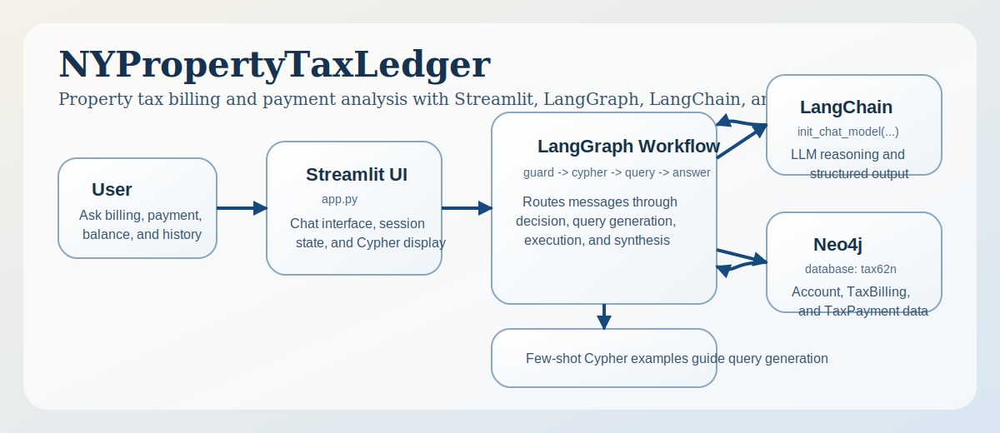
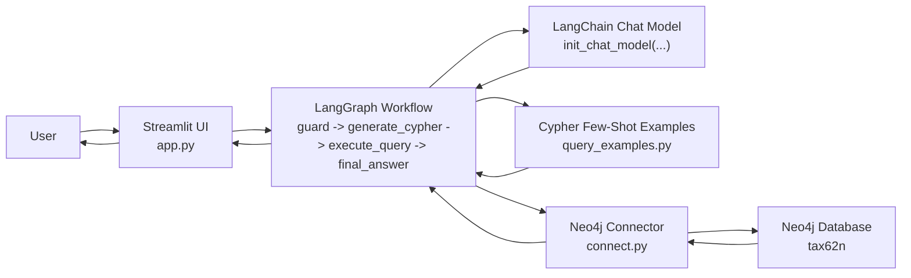

# NYPropertyTaxLedger



`NYPropertyTaxLedger` is a small Streamlit and LangGraph app for exploring property tax billing and payment data stored in Neo4j.

It was initialized from the archived `tax62_chatbot` prototype and cleaned up into a standalone repository layout.

## Features

- Streamlit chat UI for tax questions
- LangGraph workflow for guard, Cypher generation, query execution, and answer synthesis
- Neo4j-backed tax billing and payment analysis
- Simple CLI conversation runner for quick testing
- PDF-to-Cypher loader for archived-style tax bill PDFs
- Filename-based tax-year normalization for loader imports
- Blockchain-style append-only `LedgerBlock` and `LedgerEntry` history

## Project Layout

```text
NYPropertyTaxLedger/
  app.py
  requirements.txt
  ny_property_tax_ledger/
    config.py
    connect.py
    graph.py
    query_examples.py
    cli_chatbot.py
    pdf_extract.py
    tax_pdf_to_cypher.py
    load_tax_pdfs.py
```

## Data Flow Architecture



Flow summary:
- The user asks a tax question in the Streamlit app.
- LangGraph checks whether the request is in scope, generates Cypher, executes it through Neo4j, and drafts a final answer.
- LangChain provides the chat model used for guard decisions, Cypher generation, and response synthesis.
- Neo4j returns billing and payment records from the `tax62n` database.
- The loader appends immutable `LedgerBlock` and `LedgerEntry` history while keeping `TaxStatement`, `Levy`, and `Payment` as projections.

## Environment

Set these environment variables before running the app:

```bash
export OPENAI_API_KEY=...
export NEO4J_URI=bolt://localhost:7687
export NEO4J_USERNAME=neo4j
export NEO4J_PASSWORD=...
export NEO4J_TAX_DB_NAME=tax62n
export TAX_FILE_FOLDER=/Users/weizhang/Downloads/tax-62n
```

## Install

```bash
python3 -m venv venv
source venv/bin/activate
pip install -r requirements.txt
```

## Run

```bash
source venv/bin/activate
streamlit run app.py
```

## Load Tax PDFs

To generate Cypher from archived-style tax PDFs and load them into `tax62n`:

```bash
source venv/bin/activate
python -m ny_property_tax_ledger.load_tax_pdfs /path/to/tax-pdfs \
  --uri "$NEO4J_URI" \
  --username "$NEO4J_USERNAME" \
  --password "$NEO4J_PASSWORD" \
  --database "$NEO4J_TAX_DB_NAME"
```

To preview generated Cypher counts without writing to Neo4j:

```bash
source venv/bin/activate
python -m ny_property_tax_ledger.load_tax_pdfs /path/to/tax-pdfs \
  --uri "$NEO4J_URI" \
  --username "$NEO4J_USERNAME" \
  --password "$NEO4J_PASSWORD" \
  --dry-run
```

If you omit the folder argument, the loader uses `TAX_FILE_FOLDER`, which defaults to `/Users/weizhang/Downloads/tax-62n`.

The loader flow is:
- Extract tables from each PDF with `pdfplumber`
- Infer the canonical tax year from the PDF filename when a year range like `2025-2026` is present
- Send the extracted structure to the configured chat model
- Generate Cypher for `TaxStatement`, `Levy`, `Payment`, `Owner`, and `Property`
- Repair common Cypher issues automatically when Neo4j rejects a generated script
- Execute schema and projection statements separately, then write each file in its own transaction against Neo4j `tax62n`
- Append one immutable `LedgerBlock` per file import and `LedgerEntry` rows for levy and payment events

## Blockchain Ledger

`NYPropertyTaxLedger` now follows the same blockchain-style design direction as `JCTaxLedger`:

- `LedgerBlock` is the append-only system of record
- `LedgerEntry` stores immutable levy and payment events for each import block
- `PREVIOUS_BLOCK` links make the chain tamper-evident
- `TaxStatement`, `Levy`, and `Payment` remain as query-friendly projections

You can verify the property ledger chain with:

```bash
source venv/bin/activate
python -m ny_property_tax_ledger.verify_property_ledger --database tax62n
```

## Notes

- The app expects the Neo4j graph schema to be available through `langchain_neo4j.Neo4jGraph`.
- The default Neo4j database is `tax62n`, unless `NEO4J_TAX_DB_NAME` is overridden.
- The sample Cypher few-shots target the split property tax model with `Account`, `TaxBilling`, and `TaxPayment`.
- The PDF loader was modernized from the archived `taxbill_loader62n.py` and `pdf2graph.py` workflow.
- The default tax PDF folder currently contains files named like `62n-2019-2020-property-tax.pdf` through `62n-2025-2026-property-tax.pdf`.
- The loader normalizes `TaxStatement.year` from the filename, so `62n-2025-2026-property-tax.pdf` is stored as `2025-2026`.
- The append-only property ledger is the system of record; the tax statement graph remains the compatibility projection.
